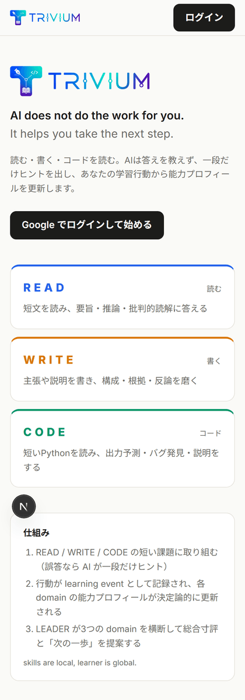
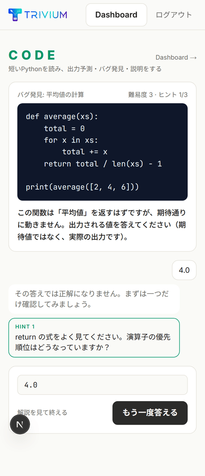
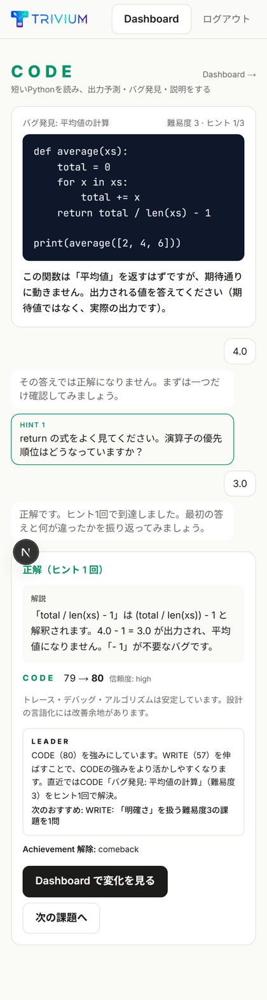
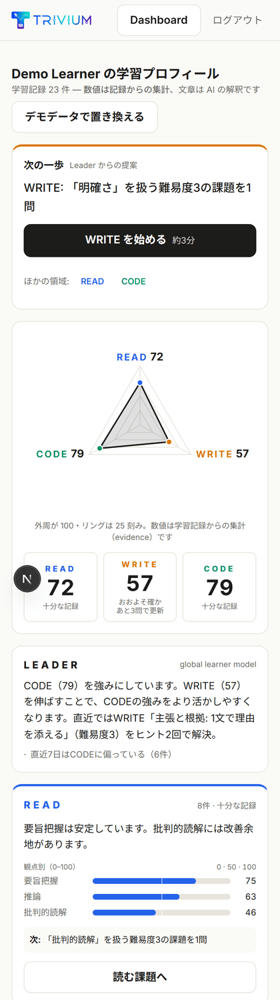
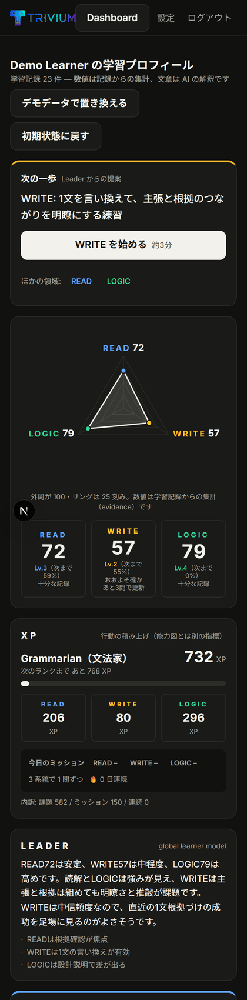
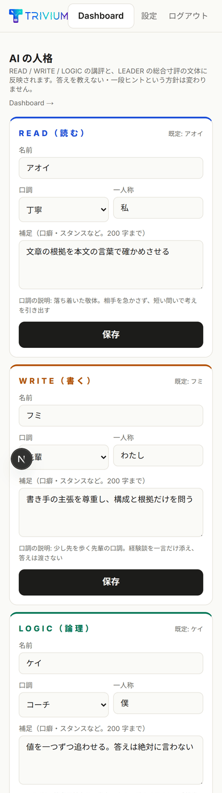
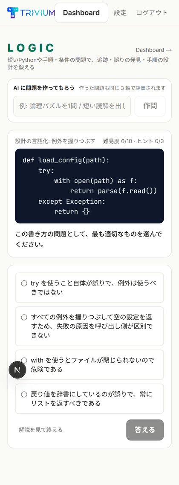

# Trivium

> **AI does not do the work for you. It helps you take the next step.**

READ / WRITE / LOGIC の短い課題に取り組むと、AI は答えを教えずに **一段だけヒント** を出します。
学習行動は learning event として記録され、系統ごとの**到達レベル**が決定論的に更新され、
その上に立つ **ADVISOR**（案内役。内部キーは `LEADER`）が 3 系統を横断して「次の一歩」を提案します。行動の積み上げは **XP・デイリーミッション・ランク** として別に可視化します。

```
                 ADVISOR（ミチ）
        global learner model
                  |
       +----------+----------+
       |          |          |
      READ       WRITE      LOGIC
     アオイ       フミ        ケイ
      memory     memory     memory

      skills are local, learner is global.
```

高校生〜成人を対象にした、24 時間で作ったプロトタイプです。特定の既存サービスの UI・文言・キャラクターは使っていません。

本番: https://trivium.153.126.213.251.sslip.io

## 何ができるか

- **Google ログイン** — 学習状態はサーバ（PostgreSQL）に永続化。別端末でも同じプロフィール
- **3 系統の課題** — **READ** 要旨・推論・批判的読解 / **WRITE** 構成・明確さ・根拠・推敲 / **LOGIC** 短い Python の読解と、手順・条件・推論のパズル（内部キーは `CODE`）。静的な課題は **63 問**（単独 51 問 + 2〜3 系統にまたがる複合課題 12 問）。難易度は系統ごとに **1〜10**、各課題は難易度ベクトル `{ read, write, code }` を持つ
- **一段ヒント** — 誤答すると AI が問い返し／ヒントを 1 つだけ。3 回まで。完成解は出さない（決定論採点が確定しているときは AI の判定を上書きする安全弁付き）
- **到達レベルの三角形** — READ / WRITE / LOGIC の到達レベル（Lv.0〜10）と観点別の証拠バー、信頼度。再計算のたびにスナップショットを保存
- **三角グラフの SNS 共有** — Dashboard の「三角グラフを共有」で、能力プロフィール（三角形・Lv・XP・キャラ）を 1200×630 の画像にブラウザ側で描き、Web Share API で LINE / X 等へ直接共有（使えない環境では画像保存＋X / LINE の投稿リンク）
- **XP・デイリーミッション・streak・ランク** — 課題 XP（難易度 × ヒント倍率）、3 系統を 1 日 1 問ずつ解くミッション、連続日数、Novice → Trivium Master のランク。Dashboard のカードと LINE の Flex カードで表示
- **4 人格の AI** — READ=ヨミ（黄泉の司書） / WRITE=フミ（赤ペン先輩） / LOGIC=ロゴス（論理の番人） / ADVISOR=ミチ（三叉路の案内人。既定はツンデレ）。ちびキャラは `public/characters/`。`/settings` で名前・口調（12 プリセット）・一人称・補足を変更でき、講評・寸評・LINE の会話に反映
- **出題する問題タイプの設定** — `/settings` で系統ごとに問題タイプ（READ: 要旨把握／推論／批判的読解／語彙・表現／図表・データ読解、WRITE: 推敲／構成／意見文／要約／書き換え、LOGIC: Python 読解／Python バグ発見／論理パズル／数的推理／手順・アルゴリズム）をチェックボックスで外せる（「Python はいらない」など）。複合問題（2 系統以上）の可否も切替。Web・LINE の出題と AI 作問の両方に効く（`src/lib/task-types.ts`、保存先は `LeaderProfile.preferences`）
- **系統ごとの観察メモと会話の記憶** — 各人格は担当系統の観察メモ（本人には見せない）を持ち、ADVISOR は 4 つのメモを読んで話す。LINE の会話は人格ごとに直近 10 往復を記憶。現在日時を知っていて、必要なときだけ Web 検索を使う
- **AI 作問** — 学習ページや LINE で「論理パズルを 1 問」「短い読解を出して」と頼むと、その場で課題を生成（系統・形式・難易度は決定論で推定し、同じ 3 系統で評価）。LINE で「LOGICで難易度8」のように指定すると、その難易度（1〜10）の検証済みストックから即出題（±1 に未回答が無ければ自動で作問。「難易度8で作って」なら常に作問）し、以後の「次」「もう1問」も同じ難易度を保つ
- **LINE 公式アカウント** — 「今日の学習」で選択式を Quick Reply 出題（「パス」で記録に残さず次へ。Web で解いた問題は LINE 側の回答待ちも自動解除）、出題・寸評・会話は担当キャラのちびアイコン付き吹き出し（Flex）、自由文で作問、名前で呼ぶとその人格が応答、今日の 3 問を解き終えると総評と「今日の 1 冊」を push。署名検証付き Webhook・Rich Menu
- **LINE ↔ Web アカウント連携** — LINE で「連携」と送るとワンタイム URL が届き、Google ログイン後に紐づく。以降 LINE の人格は実際の学習記録で答える（「連携解除」でいつでも解除）
- **○ ✕ △ の明示** — 正解は ○、誤答→ヒントで再挑戦は △、ヒント切れ・ギブアップは ✕。Web の吹き出し・結果カードと LINE の返信で大きく表示
- **LINE の会話は自由** — 短いコマンド（READ / 今日の学習 / 履歴 など）以外の文は人格との自由会話（雑談・相談・概念の説明・時事は Web 検索）。1 問ごとの push は「Lv 変化と XP」だけで、人格と案内役の寸評は 5 問ごと（`src/config/trivium.config.ts` の `LINE`）
- **選択式の講評キャッシュ** — （課題 × 回答 × ヒント段階 × 人格）で講評を保存し、2 回目以降は LLM を呼ばない。`npm run warm-cache` で事前生成
- **Demo Seed / 初期状態に戻す** — 架空の約 10 日分の学習履歴をワンクリックで投入、または学習状態を全消去（人格設定と LINE 連携は残る）
- **使い方ガイド `/guide`** — ログイン不要。サービスの考え方、3 系統とキャラ、難易度 1〜10 の目安、到達レベルと採点、三角グラフの読み方、XP・ランク（設定ファイルの実値を表示）、LINE の使い方、AI の 7 か条。ヘッダーの「使い方」と LINE のヘルプ／リッチメニューから遷移

## 問題ストック（生成・検証済み）

手書きの 63 問に加えて、**難易度 1〜10 × READ / WRITE / LOGIC** の課題を `scripts/stock/gen_stock.mts` で事前生成し、`src/lib/tasks/stock/*.generated.ts` に同梱している（手で編集しない）。生成時に **Python の出力予測問題は実際にコードを実行して正解を照合**、それ以外の選択式は**独立したソルバー**（正解を見ずに解く別の呼び出し）と照合し、一致しないものは捨てる。さらに「正解だけが目立って長い」「ヒントが本文の接続詞を教える」ものも弾き、書き出し時に選択肢を id ごとに回転させて正解位置（A〜D）の偏りをなくす。

### 採点と出題の安全策（2026-08-28 のレビューで追加）
- 到達レベルの降格にはヒステリシス（既到達レベルは正答率 0.5 まで維持）。失敗の否定証拠は「その難易度以上」にだけ効き、複合課題のボトルネックは主系統 1 軸に帰属する
- 推薦難易度は直近 3 件の結果で下限を置く（初回の正解で難易度が下がらない）。Dashboard・LINE カードの数値は保存値ではなく、その時点の live 計算
- 決着済みの課題への再提出や 60 秒以内の二重送信は「練習モード」（記録なし）。自由記述はヒューリスティック（字数・必須語）を満たさなければ AI が合格と言っても不合格
- LINE: 「連携解除」は確認ボタン付き。会話文が出題・作問に誤爆しないよう意図判定を絞り、「〜に聞く」の宛先メモは 30 分で失効
- `/api/demo/warm` は `ADMIN_EMAILS` の管理者のみ。デモログインは `DEMO_LOGIN_SECRET`（合言葉）ストックがあるので通常の出題と LINE の「難易度 N」は LLM を呼ばずに即応答する。`tests/tasks.test.ts` が id 形式・4 択・難易度・skillTags・ヒント 3 段などをストックにも適用する品質ゲートになっている。同じ難易度の候補が複数あるときはユーザーごとに決定論的にばらけて出題される（乱数は使わない）。

```bash
npx tsx scripts/stock/gen_stock.mts                  # 3 系統すべて（difficulty 1〜10。済んだスロットは scripts/stock/out/*.json から再開）
npx tsx scripts/stock/gen_stock.mts --domain code    # 1 系統だけ
npx tsx scripts/stock/gen_stock.mts --emit-only      # 生成せずに *.generated.ts を書き出す
npx tsx scripts/characters/gen_moods.mts             # キャラの表情差分（public/characters/<agent>-<mood>.png）を基準絵から生成
```

## 画面

| ホーム | 学習（一段ヒント） | 結果とプロフィール更新 |
|---|---|---|
|  |  |  |

| Dashboard（到達レベル・XP・ミッション） | Dashboard（ダーク） | 人格の設定 | 学習ページ（AI 作問） |
|---|---|---|---|
|  |  |  |  |

## 数値 = evidence、文章 = AI interpretation

能力の数値は **LLM に決めさせません**。`learning_events` から `src/lib/scoring.ts` が決定論的に集計します。

- 各課題は難易度ベクトル `{ read, write, code }`（1〜10、0 = その系統に無関係）を持つ。複合課題は複数の系統が正
- **成功**は関与する全系統に「その難易度以下は解ける」証拠を与える（重み = 新しさ × ヒント基礎点）
- **失敗**は「相対的に最も難しかった系統（ボトルネック）」だけに、その難易度付近の否定証拠を与える。`(read 3, write 2, logic 8)` の課題を落としても READ / WRITE は下がらない
- **到達レベル** L = 難易度 d 以上での正答率が 70% を超える最大の d（それ未満は解けるとみなす）。表示スコア = L × 10 + 次のレベルへの進捗 × 10
- 観点別のバー（要旨把握・手順の追跡など）は、ヒント基礎点（ヒントなし 1.0 / 1 回 0.8 / 2 回 0.6 / 3 回 0.5 / 失敗 0.2）× 難易度重み × 新しさ重みの平均
- 記録が少ないうちは「信頼度: low（分析中）」と表示し、一回の失敗で「苦手」とは断定しない

LLM に任せるのは**解釈**だけです: 講評とヒントの選択、系統ごとの寸評と観察メモ、ADVISOR の総合寸評、人格としての会話、作問。

| provider | 説明 |
|---|---|
| `openai` | **既定**。OpenAI Responses API を server-side から直接呼ぶ（structured outputs で JSON 固定、system にポリシー 7 か条と人格）。役割ごとのモデルは `src/config/trivium.config.ts` の `MODELS`（採点・寸評・会話 `gpt-5.4-mini`、作問 `gpt-5.5`） |
| `dify` | Dify Workflow 経由。`dify/*.yml`（3 本、LLM は OpenAI）をインポートすればそのまま動く |
| `anthropic` | Claude API（任意・非推奨。整理予定 [#7](https://github.com/kojima8924/trivium-ai/issues/7)） |
| `mock` | ルールベース。キー不要。上のどれかが失敗したときも **自動でここにフォールバック** し、アプリは止まらない |

## 運営者がいじるファイル: `src/config/trivium.config.ts`

秘密情報以外の「運営の判断」はこの 1 ファイルに集めてあります。書き換えて再デプロイすれば反映されます（ユーザーごとの上書きは `/settings` が DB に保存し、こちらより優先）。

| 章 | 定数 | 何が変わるか |
|---|---|---|
| 1. AI モデル | `MODELS` | 役割ごとのモデル ID と推論の深さ（評価・寸評・ADVISOR・会話・作問）。作問だけ上位モデル |
| 2. 人格 | `TONE_PRESETS` / `PERSONA_DEFAULTS` | 口調プリセット 12 種（丁寧・フランク・先輩・コーチ・ツンデレ・クール・元気・厳格・メンター・おちゃめ・学者・相棒）と、4 人格の既定（名前・口調・一人称・補足・呼びかけの別名） |
| 3. 難易度と採点 | `SCORING` / `TASK_TYPES` | 到達レベルの正答率しきい値、必要な証拠量、新しさの半減期、ヒント基礎点、失敗の帰属幅、課題の 7 類型 |
| 4. XP | `XP` | 難易度あたりの XP、ヒント倍率、ミッションボーナス、streak、ランクのしきい値と称号 |
| 5. 推薦 | `RECOMMENDATIONS` | 系統別の書籍・サイト（LLM に書名を作らせない。ここから選ぶ） |
| 6. 外部情報 | `EXTERNAL` | 現在日時を prompt に入れるか、Web 検索を許可する経路、会話の記憶往復数、観察メモの上限 |

## 技術スタック

Next.js 16 (App Router, TypeScript) · PostgreSQL · Prisma 7 · Auth.js v5 (Google) · Recharts · OpenAI Responses API（server-side）· LINE Messaging API（Flex Message）· Docker / GitHub Actions / GHCR / Coolify

## ローカル開発

```bash
npm install                 # postinstall で prisma generate
cp .env.example .env        # 値を埋める（下記）
npx prisma dev -d -n trivium   # Docker 不要のローカル PostgreSQL（PGlite）。Docker があれば docker compose up -d でも可
npx prisma migrate dev      # migration 適用
npm run dev                 # http://localhost:3000
```

Google OAuth を用意しなくても、`DEMO_LOGIN_ENABLED=true` にすれば「デモとして入る」でログインできます（本番では false 推奨）。

```bash
npm run typecheck && npm run lint && npm test && npm run build
npm run seed:demo -- --email you@example.com   # CLI から demo seed（--reset で入れ直し）
npm run warm-cache -- --email you@example.com --concurrency 1   # 選択式の講評キャッシュを事前生成
npm run line:richmenu                          # LINE Rich Menu 作成（APP_URL を公開 URL にして実行）
npm run preflight -- https://<公開URL>         # デプロイ先の健全性チェック（デモ直前に実行）
```

> ローカルの `prisma dev`（PGlite）は並列アクセスに弱く、落ちることがあります（[#8](https://github.com/kojima8924/trivium-ai/issues/8)）。`warm-cache` は `--concurrency 1` で実行してください。開発用スクリプトの一覧は [`scripts/dev/README.md`](scripts/dev/README.md)。

## 環境変数

`.env.example` を参照。実値はコミットしません。

| 変数 | 用途 |
|---|---|
| `NEXT_PUBLIC_APP_URL` / `APP_URL` / `AUTH_URL` | 公開 URL（3 つとも同じ値。`APP_URL` は実行時にサーバが優先して読む） |
| `DATABASE_URL` | PostgreSQL 接続文字列（Coolify 内部ネットワーク。5432 を公開しない） |
| `AUTH_SECRET` / `AUTH_TRUST_HOST` | Auth.js |
| `AUTH_GOOGLE_ID` / `AUTH_GOOGLE_SECRET` | Google OAuth（server only） |
| `DEMO_LOGIN_ENABLED` | デモ用フォールバックログイン（既定 false） |
| `DEMO_SEED_ENABLED` | Dashboard の「デモデータを投入」「初期状態に戻す」と `/api/demo/warm`（既定 true） |
| `AI_PROVIDER` | `openai`（既定）/ `dify` / `anthropic` / `mock` |
| `OPENAI_API_KEY` / `OPENAI_TIMEOUT_MS` / `OPENAI_MODEL` | OpenAI（server only）。モデルは `trivium.config.ts` の `MODELS` が役割ごとに決める。`OPENAI_MODEL` は役割指定が無い呼び出しの予備 |
| `DIFY_API_BASE` / `DIFY_DOMAIN_API_KEY` / `DIFY_LEADER_API_KEY` / `DIFY_GENERATE_API_KEY` / `DIFY_TIMEOUT_MS` | Dify Workflow（server only。`AI_PROVIDER=dify` のとき） |
| `ANTHROPIC_API_KEY` / `ANTHROPIC_MODEL` / `ANTHROPIC_TIMEOUT_MS` | Claude API（任意・非推奨） |
| `LINE_CHANNEL_SECRET` / `LINE_CHANNEL_ACCESS_TOKEN` | LINE Messaging API |

## 主なエンドポイント

| パス | 説明 |
|---|---|
| `GET /api/health` | DB 疎通と AI provider の状態（直近のエラー要約を含む。鍵は伏字） |
| `GET /api/learn/next?domain=read\|write\|logic[&task=id]` | 次の課題（正解・ヒント・解説は含まない）。弱い観点を優先 |
| `POST /api/learn/submit` | 回答 → 決定論採点 → AI の講評 / 一段ヒント → 決着時に learning event 記録 → 到達レベル・XP・ADVISOR 再計算 |
| `POST /api/learn/generate` | 自由文の依頼から課題を 1 問生成（`{request, domain?, kind?, difficulty?}`） |
| `GET /api/profile` | Dashboard と同じプロフィール JSON（到達レベル・XP を含む） |
| `POST /api/demo/seed` / `POST /api/demo/reset` / `POST /api/demo/warm` | デモ履歴の投入 / 初期状態に戻す / 選択式講評のキャッシュ生成（自分のアカウントにのみ） |
| `GET /settings` | 4 人格の設定 |
| `POST /api/line/webhook` | LINE Webhook（署名検証） |
| `GET /link/<token>` | LINE 連携の確認ページ（POST で消費。単回・15 分） |

## ドキュメント

- [ARCHITECTURE.md](ARCHITECTURE.md) — 構造とデータフロー（採点モデル・XP・人格と記憶・LINE）
- [DEPLOY.md](DEPLOY.md) — GitHub Actions → GHCR → Coolify（さくら VPS）へのデプロイ、Google / Dify / LINE の設定
- [DEMO.md](DEMO.md) — 3 分のデモ台本
- [dify/README.md](dify/README.md) — Dify Workflow DSL（任意）
- [scripts/dev/README.md](scripts/dev/README.md) — 開発・検証スクリプト

## 24 時間でどう作ったか

- 2026-08-27 21:00 に空のリポジトリから開始。feature 単位のコミットは **50 本以上**（`git log --oneline | wc -l`）
- Claude Code を使い、土台（schema・採点・AI 抽象層・認証）を先に固めてから、UI / LINE / Dify / テスト / デプロイ / 問題コンテンツ / ゲーミフィケーション / 人格と記憶を**並列のサブエージェントと Codex CLI に分担**。ファイル所有を分けて衝突を避け、統合とレビューは 1 か所で行った
- 統合後に**多角レビュー**（正確性・セキュリティ・フレームワーク API・デプロイ・UX・ドキュメント）と敵対的検証を回し、実在した問題だけを修正 — 例: 全角入力で正解判定が落ちる、`/login?next=` のオープンリダイレクト、ヒント回数の自己申告による水増し、ヒント文に完成解が混ざっていた問題
- テストは **100 件以上**（`node:test`）。CI は typecheck / lint / test / build に加えて **Docker イメージを実ビルドして起動し `/api/health` まで確認**し、main への push で GHCR にイメージを公開。Coolify（さくら VPS）はそれを pull するだけ（VPS 上ではビルドしない）
- 製品化に向けた課題は [Issues](https://github.com/kojima8924/trivium-ai/issues) に整理（時系列グラフ、LINE の三角形画像、評価軸の一般化、作問ナレッジの蓄積、出題スケジュール、答えやすさの設定 など）

## セキュリティ方針

API key / OAuth secret はサーバ側 env のみ。`.env` はコミットしない。PostgreSQL は公開しない。
LINE Webhook は署名検証。LLM へは PII（メール・氏名）を渡さず内部 ID のみ。DB アクセスは Prisma 経由。
状態を変える API はクロスサイト POST を拒否し、ユーザー単位のレート制限を持つ。ヒント回数はサーバ側が正本。

## やらないこと（現時点の範囲外）

課金・SNS・ランキング・複雑な権限管理・巨大 RAG・microservices・IRT などの高度な能力推定。
